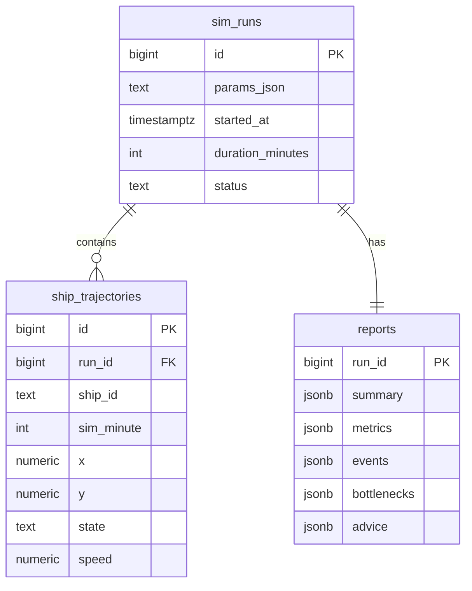

# 港口船舶交通流仿真与安全评估 Dashboard · 技术架构文档

## 1. 架构设计

整体为前后端分离 + 容器编排的微服务结构。Go 后端提供仿真引擎与 REST/SSE API,Vue3 前端负责可视化,PostgreSQL 持久化轨迹与报告,Nginx 托管前端构建产物。

```mermaid
flowchart LR
    subgraph "浏览器"
        "Vue3 + ECharts Dashboard"
    end
    subgraph "后端容器 golang:1.21-alpine"
        "HTTP API (chi)"
        "仿真引擎"
        "潮汐/流量/安全模块"
        "配置热更新 (fsnotify)"
    end
    subgraph "数据层 postgres:16-alpine"
        "sim_runs"
        "ship_trajectories"
        "reports"
    end
    subgraph "前端容器 nginx:alpine"
        "静态资源"
    end
    "Vue3 + ECharts Dashboard" -->|REST/SSE| "HTTP API (chi)"
    "HTTP API (chi)" --> "仿真引擎"
    "仿真引擎" --> "潮汐/流量/安全模块"
    "仿真引擎" --> "配置热更新 (fsnotify)"
    "HTTP API (chi)" --> "数据层 postgres:16-alpine"
    "Vue3 + ECharts Dashboard" -->|静态资源| "前端容器 nginx:alpine"
```

## 2. 技术说明

- **后端语言**:Go 1.21。
- **HTTP 路由**:`github.com/go-chi/chi/v5`,轻量符合标准库习惯。
- **配置热更新**:`github.com/fsnotify/fsnotify` 监听 YAML 变更后重载。
- **数据库驱动**:`github.com/jackc/pgx/v5`。
- **仿真引擎**:自研离散事件循环,时间步 1 分钟。
- **前端框架**:Vue3 + TypeScript + Vite + TailwindCSS。
- **可视化**:ECharts(折线/直方/雷达/热力图) + Canvas2D(港口动画)。
- **状态管理**:Pinia。
- **数据库**:PostgreSQL 16。
- **容器**:golang:1.21-alpine(后端)、nginx:alpine(前端)、postgres:16-alpine(数据)。

## 3. 路由定义(前端)

| 路由 | 用途 |
|------|------|
| `/` | 仿真驾驶舱(实时动画 + KPI + 图表) |
| `/config` | 参数与港区模型配置 |
| `/sensitivity` | 参数敏感性实验 |
| `/replay` | 历史回放 |
| `/report/:runId` | 评估报告 |

## 4. API 定义

### 4.1 配置与模型
- `GET /api/config` → 返回当前航道/泊位/锚地/潮汐/仿真参数。
- `PUT /api/config` → 更新仿真参数(到达率/时长/倍率/潮汐/气象)。
- `GET /api/tide?hours=24` → 返回未来 N 小时潮位序列。

### 4.2 仿真控制
- `POST /api/sim/run` → body `{durationHours, arrivalRate, speedFactor, seed, wind, visibility}`,启动并返回 `{runId}`。
- `POST /api/sim/:runId/control` → `{action: start|pause|resume|reset, rate: 1|5|20|0}`。
- `GET /api/sim/:runId/state` → 当前帧快照(船舶列表/航段拥堵/KPI)。
- `GET /api/sim/:runId/stream` → SSE 实时帧推送。

### 4.3 敏感性实验
- `POST /api/sensitivity/single` → `{param, from, to, step}`,返回指标曲线。
- `POST /api/sensitivity/dual` → `{paramX, fromX, toX, stepX, paramY, fromY, toY, stepY}`,返回热力图矩阵。

### 4.4 历史与报告
- `GET /api/runs` → 历史仿真列表。
- `GET /api/runs/:runId` → 单次仿真元数据 + 轨迹(按时间索引)。
- `GET /api/runs/:runId/trajectory?from=&to=` → 区间轨迹。
- `GET /api/runs/:runId/report` → 评估报告;`?format=json` 下载。

## 5. 服务端架构图

```mermaid
flowchart TD
    "Router (chi)" --> "ConfigHandler"
    "Router (chi)" --> "SimHandler"
    "Router (chi)" --> "SensitivityHandler"
    "Router (chi)" --> "ReportHandler"
    "ConfigHandler" --> "ConfigService"
    "SimHandler" --> "Engine"
    "Engine" --> "TideModel"
    "Engine" --> "TrafficGenerator"
    "Engine" --> "SafetyAssessor"
    "SensitivityHandler" --> "SweepRunner"
    "SweepRunner" --> "Engine"
    "ReportHandler" --> "Store"
    "ConfigService" --> "ConfigReloader"
    "Store" --> "PostgreSQL"
```

## 6. 数据模型

### 6.1 数据模型定义



### 6.2 数据定义语言

```sql
CREATE TABLE IF NOT EXISTS sim_runs (
    id BIGSERIAL PRIMARY KEY,
    params_json JSONB NOT NULL,
    started_at TIMESTAMPTZ NOT NULL DEFAULT now(),
    duration_minutes INT NOT NULL,
    status TEXT NOT NULL DEFAULT 'running'
);
CREATE INDEX IF NOT EXISTS idx_sim_runs_started ON sim_runs(started_at DESC);

CREATE TABLE IF NOT EXISTS ship_trajectories (
    id BIGSERIAL PRIMARY KEY,
    run_id BIGINT NOT NULL REFERENCES sim_runs(id) ON DELETE CASCADE,
    ship_id TEXT NOT NULL,
    sim_minute INT NOT NULL,
    x DOUBLE PRECISION NOT NULL,
    y DOUBLE PRECISION NOT NULL,
    state TEXT NOT NULL,
    speed DOUBLE PRECISION NOT NULL
);
CREATE INDEX IF NOT EXISTS idx_traj_run_time ON ship_trajectories(run_id, sim_minute);
CREATE INDEX IF NOT EXISTS idx_traj_ship ON ship_trajectories(run_id, ship_id, sim_minute);

CREATE TABLE IF NOT EXISTS reports (
    run_id BIGINT PRIMARY KEY REFERENCES sim_runs(id) ON DELETE CASCADE,
    summary JSONB NOT NULL,
    metrics JSONB NOT NULL,
    events JSONB NOT NULL,
    bottlenecks JSONB NOT NULL,
    advice JSONB NOT NULL,
    created_at TIMESTAMPTZ NOT NULL DEFAULT now()
);
```

## 7. 关键算法说明

- **潮汐模型**:潮位 `h(t)=Σ H_i·cos(σ_i·t+φ_i)`,i∈{M2(12.42h),S2(12h),K1(23.93h)},幅相由配置给定;可通行水深=基准水深+潮位,小于 1.2 倍吃水禁行。
- **泊松到达**:按指数间隔 `Δt=-ln(U)/λ` 排定到达事件,默认 λ=3 艘/小时。
- **安全间距**:同向纵向≥3 倍船长;航道同时通行数=⌊宽度/最大船宽⌋;会遇安全距离阈值=2 倍船宽之和。
- **DCPA/TCPA**:基于相对运动矢量解析;TCPA<5min 且 DCPA 不安全触发碰撞预警。
- **敏感性**:每组不同随机种子取 3 次均值。
